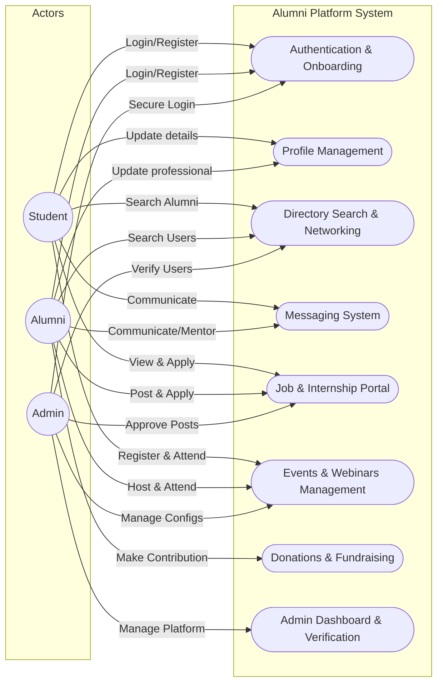
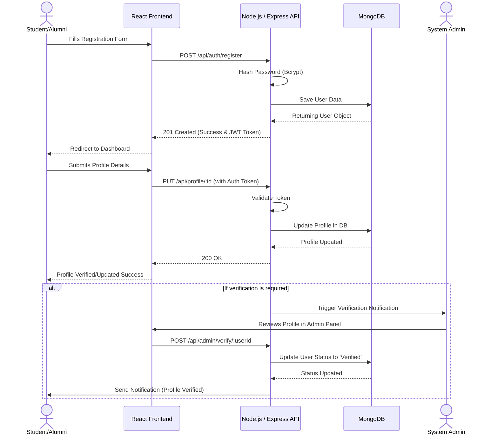
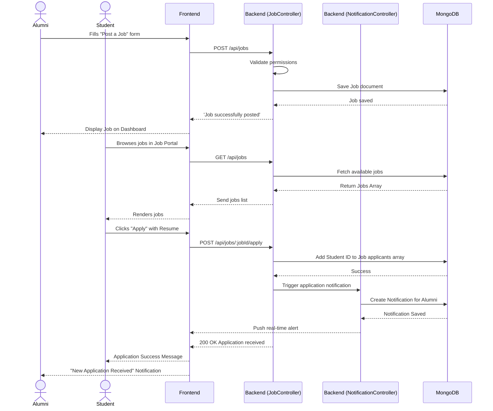

# UML Diagrams for Alumni Platform

Here are the Use Case and Sequence diagrams based on the features of your Alumni-Student platform.

## Use Case Diagram

---

## Sequence Diagrams

### 1. User Authentication & Profile Verification Flow

### 2. Job Application Flow

